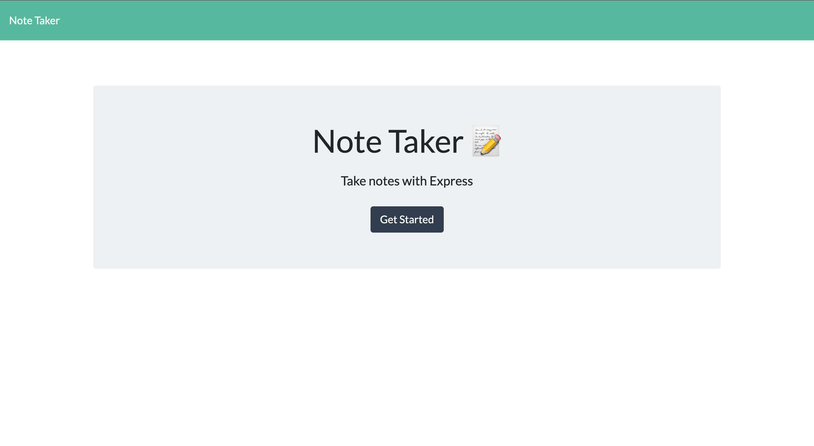

# Note Taker Starter Code
## Description
Create an application called Note Taker that can be used to write and save notes. This application will use an Express.js back end and will save and retrieve note data from a JSON file.

Here's a link to the recorded video: https://watch.screencastify.com/v/TvLGwGzPKbdA1wpbGfjg

## Table of Contents
  - [Description](#description)
  - [Table of Contents](#table-of-contents)
  - [User Story](#user-story)
  - [Acceptance Criteria](#acceptance-criteria)
  - [Installation](#installation)
  - [Usage](#usage)
  - [Contributing](#contributing)
  - [Questions](#questions)

## User Story
* AS A small business owner
* I WANT to be able to write and save notes
* SO THAT I can organize my thoughts and keep track of tasks I need to complete
## Acceptance Criteria
* GIVEN a note-taking application
* WHEN I open the Note Taker
* THEN I am presented with a landing page with a link to a notes page
* WHEN I click on the link to the notes page
* THEN I am presented with a page with existing notes listed in the left-hand column, plus empty fields to enter a new note title and the note’s text in the right-hand column
* WHEN I enter a new note title and the note’s text
* THEN a Save icon appears in the navigation at the top of the page
* WHEN I click on the Save icon
* THEN the new note I have entered is saved and appears in the left-hand column with the other existing notes
* WHEN I click on an existing note in the list in the left-hand column
* THEN that note appears in the right-hand column
* WHEN I click on the Write icon in the navigation at the top of the page
* THEN I am presented with empty fields to enter a new note title and the note’s text in the right-hand column

## Installation
* Open the command line terminal and go to the proper directory
* Clone the git repo from :octocat: [kea6t](https://github.com/kea6t)
* Then type npm init to install dependencies
* Then type npm install inquirer@8.2.4
* Then npm i express
* Then enter: "node server" to launch 🚀
* Then open localhost:3003 to see app

## Usage
* See the live version of the app here [Note Taker](https://saving-notes.herokuapp.com/)

## Contributing
:octocat: [kea6t](https://github.com/kea6t)

This was generated with ❤️ made by Kenny 🔥🌌🌳🦝🚀

## Questions
If you have any questions :grey_question:, please send me an email at: :e-mail: Email me with any questions: sampleEmail@gmail.com
